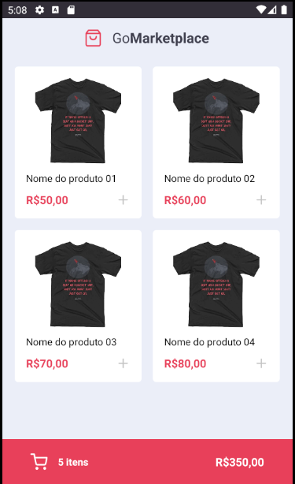
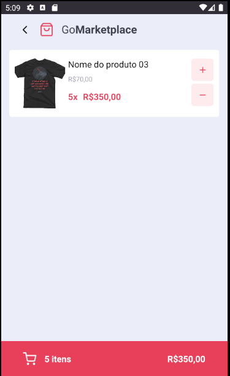

# GoMarketplace
Repositório para o projeto GoMarketplace desenvolvido durante as aulas do GoStack 13 na Rocketseat.

### Descrição

Nesse desafio, você desenvolverá uma nova aplicação, a GoMarketplace. Dessa vez é hora de você praticar o que você aprendeu até agora no React Native junto com o TypeScript, utilizando rotas, Async Storage e a Context API.

### Como o projeto está atualmente




### Utilizando uma fake API

Antes de tudo, para que você tenha os dados para exibir em tela, criamos um arquivo que você poderá utilizar como fake API para te prover esses dados.

Para isso, deixamos instalado no seu package.json uma dependência chamada `json-server`, e um arquivo chamado `server.json` que contém os dados para uma rota `/products`. Para executar esse servidor você pode executar o seguinte comando:

```js
  yarn json-server server.json -p 3333
```

### Executando aplicação

Após clonar o repositório em sua máquina, execute a api fake acompanhado de um emulador de sua escolha. Com as duas etapas iniciais concluídas é só executar os comandos abaixo em um terminal dentro da pasta raiz do projeto. 

```js
  yarn start
```

Para android: 

```js
  yarn android
```

Para IOs: 

```js
  yarn ios
```

### License
MIT License

Copyright (c) 2020 Antonio Lisbôa

Permission is hereby granted, free of charge, to any person obtaining a copy of this software and associated documentation files (the "Software"), to deal in the Software without restriction, including without limitation the rights to use, copy, modify, merge, publish, distribute, sublicense, and/or sell copies of the Software, and to permit persons to whom the Software is furnished to do so, subject to the following conditions:

The above copyright notice and this permission notice shall be included in all copies or substantial portions of the Software.

THE SOFTWARE IS PROVIDED "AS IS", WITHOUT WARRANTY OF ANY KIND, EXPRESS OR IMPLIED, INCLUDING BUT NOT LIMITED TO THE WARRANTIES OF MERCHANTABILITY, FITNESS FOR A PARTICULAR PURPOSE AND NONINFRINGEMENT. IN NO EVENT SHALL THE AUTHORS OR COPYRIGHT HOLDERS BE LIABLE FOR ANY CLAIM, DAMAGES OR OTHER LIABILITY, WHETHER IN AN ACTION OF CONTRACT, TORT OR OTHERWISE, ARISING FROM, OUT OF OR IN CONNECTION WITH THE SOFTWARE OR THE USE OR OTHER DEALINGS IN THE SOFTWARE.
